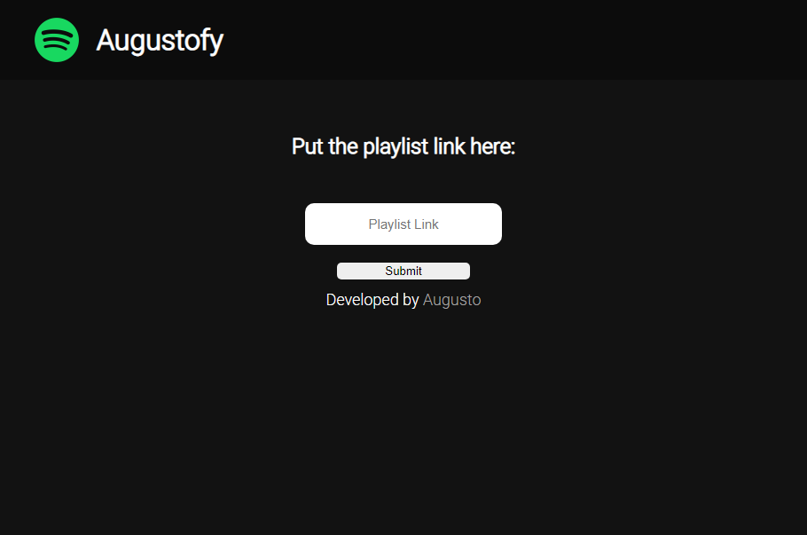
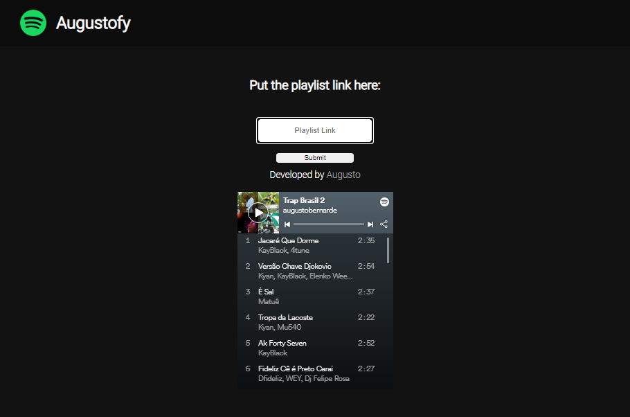
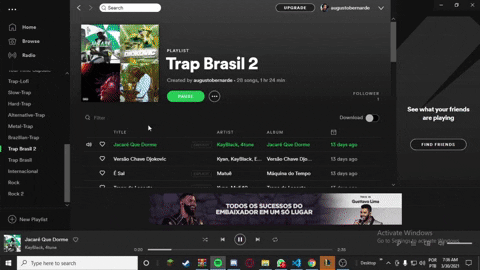

# About Augustofy 📑

This is my little project to train about JavaScript it isn't the Spotify copy, i think you are asking: "So what is this?"
And i say: "Keep calm my little grasshopper, here you put your playlist link and will show to you on the page , and the best you can listen it !"

# Data 💾

1. Fist we need to think "How we will know if it's a spotify playlist ? "
 to check i created a function and check (if text sent start with "https://open.spotify.com/playlist/" it is a spotify playlist)  

2. After we use the submit area the JavaScript clean the area.

3. Now we need to think "If i just put the spotify playlist to show it works ? "The answer is no."
Have a difference between the Iframe and the Link from spotify and i fond just compare this links:
  1- Playlist Link from Iframe: https://open.spotify.com/embed/playlist/6whxqvrunw3dy7I5fMKt2R
  2- Playlist from user link: https://open.spotify.com/playlist/6whxqvrunw3dy7I5fMKt2R?si=IFxdHzi_SWOf98IRRouWSA

4. Yes i know have this /embed/ so what can we make ?
Remember we checked if its a Spotify playlist , we can use it to creat a "var" to concatenate with 
music "ID".

5. To get just the music ID i used (let adressPlaylist = playlist.substr(34,)) <- This code get the rest
of the spotify link removing the fist part : https://open.spotify.com/playlist/.

6. And in the final we concatenate the fist part (https://open.spotify.com/embed/playlist/) With embed to work at browser.
And the playlist ID (6whxqvrunw3dy7I5fMKt2R?si=IFxdHzi_SWOf98IRRouWSA)

# Preview Design 🖥️

# Preview Playlist 🎵

# Functional Example ⚙️

